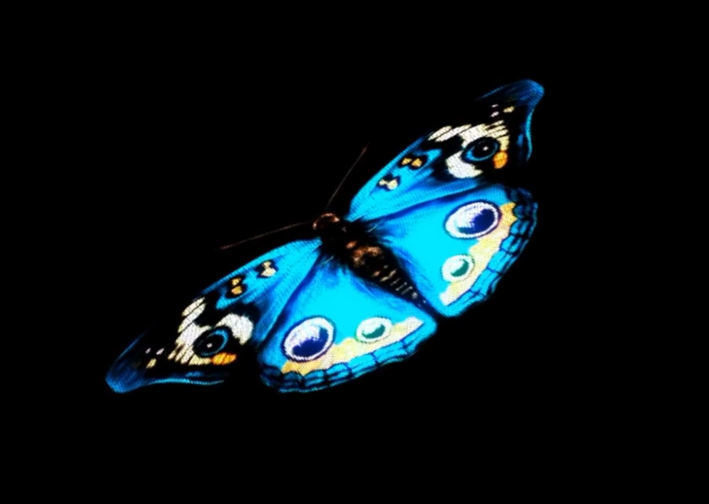
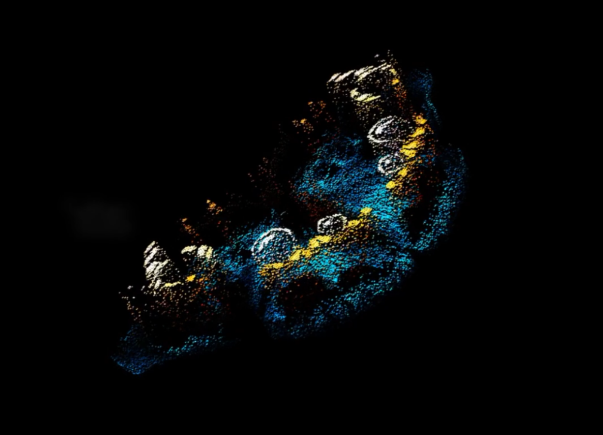

# **Redesign of ''Wheels of Fortune''**

## **Instruction of Work**
- ### **Introduction**  
  Initially, the particles gradually fade in to generate and form a circle, while in the formation of the circle, 3 rings are generated in order from the inside to the outside, at the end of the generation, all the circles will have particles of different colors, and they are merged to form a larger circle, which will change color at high frequency until it disappears in the following time.

## **Details of Work**
- ### **Running Style**  
  
  The driving source for this project is **time**.
- ### **Animation Introduction**
  
  In this project, the process of generating each **circle and ring**, as well as the process of merging them into one **large circle**, will be animated. Except for the fact that the color and size of each circle will be different from the group's work, I remade most of the code so that the particle system can follow the pattern of **“Generate multiple circles of different colors - merge them into one big circle - big circle”. keep changing colors until it disappears”** loop to play the animation.
  
  So, I made small changes to the group code regarding the layout and color of the circle arrangement, but for the animation aspect and visual effects I made a lot of changes
- ### **Group Members Animation Introduction**
  **Jackie**：Dynamically change the radius size of the circles and the color of the dots based on the energy of the music.

  **Mere**：Perlin noise is used to randomize the initial position of each circle, as well as randomize the size and the circle. Also randomly generated are the colors of the inner circles.

  **Ann**：Circles and patterns switch positions on mouse click.

- ### **Inspiration**
  
  This project was largely inspired by these two images, and as I mentioned in my Week8 assignment, I think the **particle system** is very applicable to this assignment project, although ultimately my choice was not an audio driver.
  
  Initially my plan was to go with oil paintings, but in the end we went with circles. However this does not affect the way I categorize, in oil paintings one can simply categorize by **color**, such as dark colors, medium tones of color, and light colors, however in the circle piece I think it can be categorized by **structure**, such as **rings and circles**. In addition to this, something like a ball of thread in the original work can be made to move separately.

- ### **Technical Details**  
  - Reference

    https://www.youtube.com/watch?v=QlpadcXok8U

    https://editor.p5js.org/codingtrain/sketches/D4ty3DgZB

    https://www.youtube.com/watch?v=yAyiQKNVtY8

    https://www.bilibili.com/video/BV1rH4y1m7fb/?spm_id_from=333.337.search-card.all.clickvd_source=68ebe7b4dac4b16b61a7855377486938
  
    https://www.bilibili.com/video/BV1De411U7nu/?spm_id_from=333.337.search-card.all.click&vd_source=68ebe7b4dac4b16b61a7855377486938

    https://download.csdn.net/download/weixin_42134054/19042282?ydreferer=aHR0cHM6Ly93d3cuYmFpZHUuY29tL2xpbms%2FdXJsPXBsemxodEN3a0EyTzhPa2NiamxWODl6b3BycHp3ZzBwNEdnMVZBTjBFN0dxb1d1Tms2MzRYUGIzeTRwMzNHakY2N2RuZDZ1czNWQW44cTdzckp0enNjUkxrbkkzZjlZak5mWTFLOWtqd2xfJndkPSZlcWlkPWY3MDkwZWU3MDAxOWRhMTMwMDAwMDAwNjY3MmRkNTU2